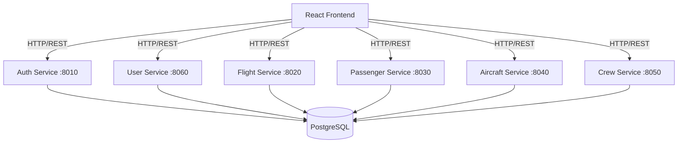

# ✈️ Airline Management Microservices System


A modern, scalable, and robust Airline Management System re-engineered from a monolith into a **Microservices Architecture**. This project demonstrates a full-stack application handling complex domain logic across multiple independent services, orchestrated via Docker.

---

## 🏗️ Architecture

The system is composed of **6 independent microservices** and a **React Frontend**, all containerized and managed by Docker Compose.



### 🚀 Services Overview

| Service | Port | Description |
| :--- | :--- | :--- |
| **Frontend** | `3000` | React-based Admin Dashboard & Booking Interface |
| **Auth Service** | `8010` | JWT Authentication & Authorization |
| **Flight Service** | `8020` | Flight scheduling, routes, and status management |
| **Passenger Service** | `8030` | Passenger booking, ticketing, and details |
| **Aircraft Service** | `8040` | Fleet management (Aircrafts & Airlines) |
| **Crew Service** | `8050` | Pilot and Cabin Crew management |
| **User Service** | `8060` | User profile and role management |

---

## 🛠️ Tech Stack

-   **Backend**: Python, FastAPI, SQLAlchemy, Pydantic
-   **Frontend**: React.js, Axios, CSS Modules
-   **Database**: PostgreSQL
-   **DevOps**: Docker, Docker Compose
-   **Tools**: Uvicorn, Pytest

---

## ⚡ Getting Started

Follow these steps to get the project running on your local machine.

### Prerequisites

-   [Docker Desktop](https://www.docker.com/products/docker-desktop) installed and running.
-   [Git](https://git-scm.com/) (optional, for cloning).

### 📥 Installation

1.  **Clone the repository**
    ```bash
    git clone https://github.com/ogulcanaral1283/CMPE331_FlightProject_v2.git
    cd CMPE331_FlightProject_v2
    ```

2.  **Build and Run with Docker Compose**
    This command will build the images for all services and the frontend, create the database, and start the containers.
    ```bash
    docker compose up --build
    ```

3.  **Access the Application**
    -   **Frontend**: Open [http://localhost:3000](http://localhost:3000) in your browser.
    -   **API Docs (Swagger UI)**:
        -   Auth: [http://localhost:8010/docs](http://localhost:8010/docs)
        -   Flight: [http://localhost:8020/docs](http://localhost:8020/docs)
        -   Passenger: [http://localhost:8030/docs](http://localhost:8030/docs)
        -   (and so on for other services...)

### 🔄 Resetting the Environment

If you encounter database schema issues or want to start fresh (wiping all data):

```bash
# Stop containers and remove volumes (WARNING: Deletes DB data)
docker compose down -v

# Rebuild and start again
docker compose up --build
```

---

## 📂 Project Structure

```
.
├── docker-compose.yml      # Orchestration for all services
├── frontend/               # React Application
│   ├── src/
│   └── Dockerfile
├── services/               # Backend Microservices
│   ├── aircraft/           # Aircraft Service
│   ├── auth/               # Authentication Service
│   ├── crew/               # Crew Service
│   ├── flight/             # Flight Service
│   ├── passenger/          # Passenger Service
│   └── user/               # User Service
└── README.md
```

---

## ✨ Key Features

-   **Microservices Pattern**: Decoupled services for better scalability and maintainability.
-   **Containerization**: Consistent development and deployment environments using Docker.
-   **Type Safety**: Full use of Python type hints and Pydantic models.
-   **Modern Frontend**: Interactive UI with real-time data fetching.
-   **Database Management**: PostgreSQL with SQLAlchemy ORM.

---

